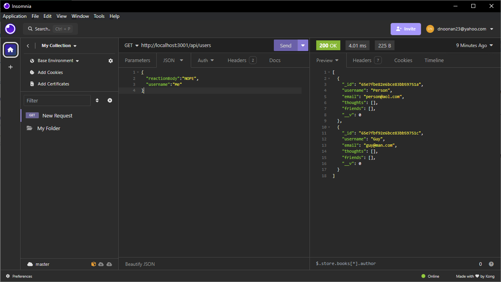

# NoSQL Challenge: Social Network API

## Description

This project was to create a Social Network application using mongoose that could find, add, alter, and delete users, thoughts, and reactions from a database.  The most difficult part was getting the friends, thoughts, and reactions to populate and delete correctly. 

## Installation

To run the program you first need node installed.  Then open the folder in a terminal and type 'npm install' to get the necesary files.  You will also need a program such as insomnia or postman to run the routes.  As well as a mongoose database connection if your are running the code from github.

## Usage

After all the proper files are installed on your computer, open your mongoose app.  Next open the folder in a terminal.  Then type `node index.js`.  It will be running on `http://localhost:3001/`.  From there use your chosen program to run GET, POST, PUT, and DELETE methods by going to `http://localhost:3001/api/users` or `http://localhost:3001/api/`.  Look at the Reaction.js, Thought.js, and User.js to see what form these take when trying to enter them.

Video demonstration: https://youtu.be/m3jxywq4F_k

## Credits

Some code modified from code taken from: 
https://git.bootcampcontent.com/

## Features

This program features routing for GET, POST, PUT, and DELETE methods using a mongoose database